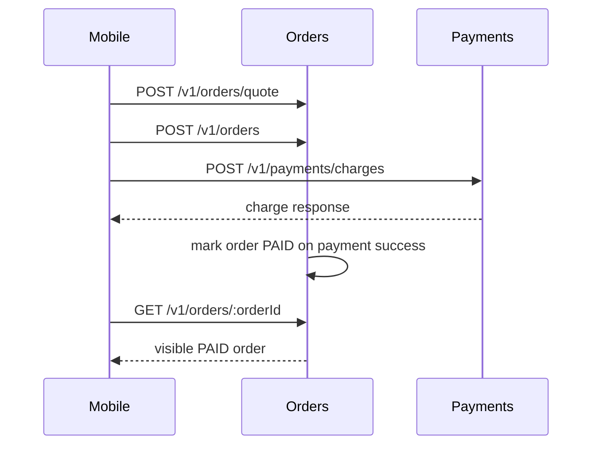

# Payment Order Flow

Last updated: `2026-03-20`

## Summary

The current checkout path is:

1. mobile builds a quote from menu items
2. orders service creates a `PENDING_PAYMENT` order from that quote
3. payments service authorizes the Clover charge
4. orders service finalizes the order as `PAID`
5. the paid order is visible through the normal order read endpoints
6. Clover webhooks can replay the same finalization safely

The orders service remains the source of truth for order status transitions. Payments is responsible for charge/refund persistence and for dispatching reconciliation events to orders.

## Normal Checkout Sequence



## Webhook Finalization

When Clover later sends a charge or refund webhook:

1. `payments` resolves the payment or refund from persisted state.
2. `payments` normalizes the webhook payload into a reconciliation event.
3. `payments` POSTs the event to `orders` at `/v1/orders/internal/payments/reconcile`.
4. `orders` applies the transition if it is still valid.
5. `payments` returns the reconciliation result to the webhook caller.

Duplicate webhook deliveries are safe in two layers:

- `payments` caches successful webhook deliveries for the life of the process and returns the prior response for identical events.
- `orders` still rejects invalid state regressions and duplicate terminal transitions.

Failed webhook dispatches are not cached, so a retry can attempt finalization again.

## Idempotency Rules

- Charges are idempotent by `orderId + idempotencyKey`.
- Refunds are idempotent by `orderId + idempotencyKey`.
- Webhook finalization is replay-safe for identical events.
- `orders` remains the authoritative guard against duplicate status transitions.

## Operational Notes

- Use `CLOVER_PROVIDER_MODE=simulated` for local development unless live Clover credentials are configured.
- Use `CLOVER_PROVIDER_MODE=live` only when the Clover charge, refund, and optional Apple Pay tokenization endpoints are set.
- `payments` now requires `ORDERS_INTERNAL_API_TOKEN` on internal charge/refund writes, and `payments` plus `orders` must share the same value for webhook reconciliation to succeed.
- `CLOVER_WEBHOOK_SHARED_SECRET` must be configured before `payments` will accept Clover webhook deliveries.
- The payment path does not write order records directly. If orders is unavailable, payments can persist the charge or refund result, but the order finalization step still depends on orders returning successfully.
- After payment, fulfillment progression depends on the configured runtime mode:
  - `staff` mode keeps the order at `PAID` until staff advances it.
  - `time_based` mode can auto-progress later reads using the configured schedule.

## Verification

```bash
pnpm --filter @lattelink/payments test
pnpm --filter @lattelink/orders test
```
