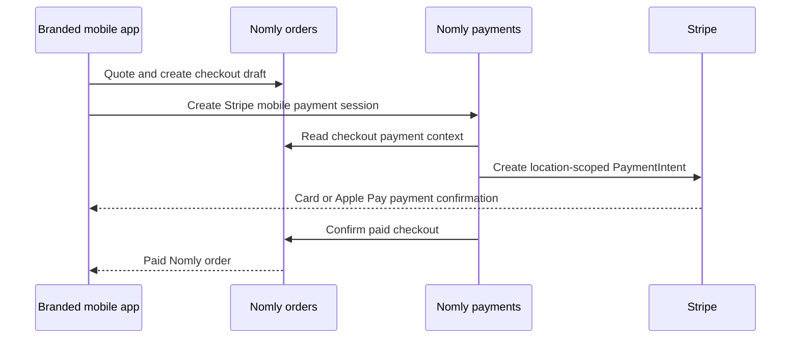

# Nomly payment and order flow

Last verified against the 1.2.0 live-dev candidate: 2026-09-23.

## Customer checkout

Nomly owns the customer order and its fulfillment lifecycle. The merchant-branded mobile app quotes catalog-backed items and creates an expiring checkout draft with the orders service. It then requests a Stripe mobile payment session for that checkout. The payments service checks the selected location's Stripe Connect readiness and enabled card method before creating a PaymentIntent under that location's connected account. Cards and Apple Pay use Stripe; Clover is not a customer checkout provider.

This is the only customer order-creation path for 1.2.0. `POST /v1/orders` is retired and returns `410 LEGACY_ORDER_CREATE_RETIRED` at both the gateway and orders service; quote creation remains available because checkout drafts use it. `GET /v1/orders` and `GET /v1/orders/:orderId` continue to read historical paid orders. The mobile SDK no longer exposes `createOrder`; callers use `createCheckoutDraft` and `createStripeMobilePaymentSession`.

After Stripe confirms payment, the payments/orders integration promotes the checkout draft to a paid Nomly order. The orders service remains authoritative for order status, and staff progress fulfillment there. Finalization, webhook, and reconciliation paths must converge on the same order and payment without duplicate side effects; the remaining recovery and account-binding work is tracked in Gate 1 issue #411.

```mermaid
sequenceDiagram
  participant App as Branded mobile app
  participant Orders as Nomly orders
  participant Payments as Nomly payments
  participant Stripe
  App->>Orders: Quote and create checkout draft
  App->>Payments: Create Stripe mobile payment session
  Payments->>Orders: Read checkout payment context
  Payments->>Stripe: Create location-scoped PaymentIntent
  Stripe-->>App: Card or Apple Pay payment confirmation
  Payments->>Orders: Confirm paid checkout
  Orders-->>App: Paid Nomly order
```

A location without a ready Stripe account or enabled card method cannot create a customer payment session. The app presents a location-level ordering-unavailable message rather than exposing provider configuration details.

## Configuration boundary

`STRIPE_SECRET_KEY`, `STRIPE_PUBLISHABLE_KEY`, and the location's Stripe Connect profile govern customer checkout. Dev uses Stripe test-mode keys and test instruments. `PAYMENTS_PROVIDER_MODE` is a legacy setting for the separate Clover POS order-submit/refund simulation path; it does **not** switch mobile checkout between Stripe and Clover. Do not use it as evidence that customer payments are simulated or Clover-powered.

The Clover POS/OAuth surface is deferred and subject to Gate 1 containment in #420. Future optional Clover work is read-only sales reporting, not order creation, charging, fulfillment, or refunds. Historical Clover charging instructions in older runbooks are not instructions for the current 1.2.0 customer journey.

## Verification

Run the mobile checkout and payments tests, then verify the Stripe test-mode order/refund journey on the live dev stack. Keep production and real customer data out of 1.2.0 verification. Gate 1 exit #421 owns the broader paid-order, recovery, and soak evidence; production promotion is a separate client #2 release decision.
